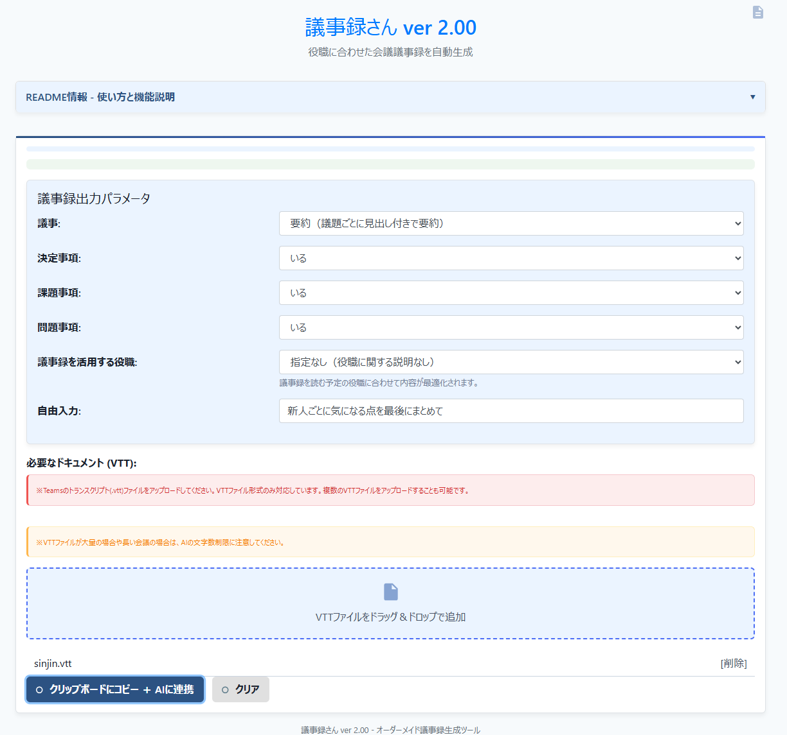

# 議事録さん ver 2.10

「**議事録さん**」は、Teamsのトランスクリプト（VTTファイル）と会議資料をドラッグ＆ドロップで読み込み、役職に合わせた会議議事録を自動生成するための HTML/JavaScript アプリケーションです。  
コピー後は、対話型AI サイトをscripts.js内のwindow.open("ここにお好みの生成AIのURL", "_blank");を設定してください。
設定したサイトが自動的に起動し、すぐにプロンプトとトランスクリプト内容と会議資料を連携できます。



画面上部には議事録出力パラメータ（詳細度・決定事項・課題事項・問題事項・役職など）の設定エリア、下部にはVTTファイルと会議資料のドロップゾーンが配置されています。  
ドラッグ＆ドロップでTeamsのトランスクリプト（VTTファイル）と会議資料（Excel, Word, PDF, PowerPoint）を追加し、「**クリップボードにコピー ＋ AIに連携**」ボタンを押すことで、テキスト抽出と AI サイトへの連携を一括で行えます。

---

## 修正履歴

### ver 2.10 (2025-05-22)
**新機能**
- 会議資料処理機能を追加
  - Excelファイルのセルデータ、コメント、空行・空列自動除去をサポート
  - Wordファイルのテキスト内容抽出、段落構造保持をサポート
  - PDFファイルのレイアウト保持テキスト抽出をサポート
  - PowerPointファイルのスライド内テキスト抽出をサポート
- 会議資料とトランスクリプトを組み合わせた高精度な議事録生成機能
- 会議資料参考要件を自動追加するプロンプト生成機能

**改善**
- UI/UXの改善：ドロップゾーンの説明を会議資料対応に更新
- ラベル表示の改善：「必要なドキュメント (VTT) + 会議資料（Excel, Word, PowerPoint, PDF）」に変更
- アラートメッセージの改善：会議資料のアップロード可能であることを明示
- ファイル処理の非同期化対応：VTTファイルと会議資料の並行処理を実現

**技術的改善**
- 新しいライブラリの追加：XLSX, PDF.js, Mammoth, JSZipのサポート
- ファイル形式判定関数の拡張：Excel, Word, PDF, PowerPointの自動識別
- エラーハンドリングの強化：ファイル読み込み失敗時の処理改善
- コード品質の向上：関数のモジュール化と可読性の改善

### ver 2.00 (2024-XX-XX)
**初回リリース**
- VTTファイル解析機能
- 柔軟な議事録パラメータ設定機能
- 自動プロンプト生成機能
- 議事録監査機能
- AIサイトとの連携機能

---

## 構成ファイル

1. **gijiroku-san.html**  
   - アプリケーションのメイン画面（HTML）。テキストエリアやドキュメントのドロップゾーンを配置しています。  
   - Bootstrap でレイアウトを簡易的に整えています。  
   - スタイルシート (`styles.css`) とスクリプト (`scripts.js`) を読み込み、機能を実現します。

2. **scripts.js**  
   - ドラッグ＆ドロップで受け取ったVTTファイルと会議資料の読み込み・テキスト抽出処理をまとめた JavaScript。  
   - Teamsのトランスクリプト（VTTファイル）を解析し、会議資料（Excel, Word, PDF, PowerPoint）からテキストを抽出し、指定されたパラメータに基づいて議事録生成用のプロンプトを作成します。  
   - 抽出したテキストをまとめてクリップボードにコピーし、対話型AI サイトを自動的に別タブで開きます。  
   - **[Ver 2.00]** 議事詳細度、決定事項、課題事項、問題事項、役職など複数のパラメータを組み合わせて最適な議事録を生成するプロンプトを作成します。
   - **[Ver 2.00]** 会議資料処理機能を追加し、Excelのセルデータとコメント、Wordのテキスト、PDFのレイアウト、PowerPointのスライド内容を抽出できます。

3. **styles.css**  
   - 全体の配色やレイアウトなど、見た目を調整するための CSS。  
   - 背景色やスクロールバーの色などをカスタマイズしています。

---

## 使い方

1. **ファイルを配置する**  
   `gijiroku-san.html`, `scripts.js`, `styles.css` を同一フォルダ内に配置してください。  
   （または同等のパス構成になるように配置してください）

2. **ブラウザで `gijiroku-san.html` を開く**  
   - Chrome や Edge などのモダンブラウザを推奨します。  
   - ローカルのダブルクリックでも基本的には動作しますが、PDF・Word 抽出などで CORS エラーが出る場合があります。  
   - エラーが出る場合は、簡易ローカルサーバー（例: `npm install -g http-server`）を立ち上げ、`http://localhost:8080` などからアクセスすると安定します。

3. **プロンプトを入力**  
   - 画面左側の「プロンプト:」欄に、AI に投げたい指示や質問などを入力してください。  

4. **トランスクリプトと会議資料のドラッグ＆ドロップ**  
   - 画面下部の「VTTファイル + 会議資料（Excel, Word, PowerPoint, PDF）をドラッグ＆ドロップで追加」エリアに、以下のファイルをドラッグ＆ドロップしてください：
     - **VTTファイル（必須）**: Teamsのトランスクリプト
     - **Excelファイル（オプション）**: .xlsx, .xls, .xlsm
     - **Wordファイル（オプション）**: .docx, .doc
     - **PDFファイル（オプション）**: .pdf
     - **PowerPointファイル（オプション）**: .pptx, .ppt
   - ファイルが読み込み候補に追加されます。

5. **内容をコピーして AI に連携**  
   - 「**クリップボードにコピー ＋ AIに連携**」ボタンを押すと、テキストエリアとドラッグ＆ドロップしたファイルの中身をすべてテキスト化・連結し、クリップボードへコピーします。  
   - コピーが完了すると、自動的に新しいタブで開きます。  
   - AI サイト上の入力欄で貼り付け（Ctrl+V / Cmd+V）すると、抽出結果＋プロンプトがすぐに利用できます。  
   - なお、コピー内容の末尾には自動で  
     ```
     以上がインプット情報です。冒頭の指示に従ってください。
     ```  
     といった文言が付与されます。

6. **クリア**  
   - 「**クリア**」ボタンを押すと、入力したプロンプトやドロップしたファイル情報がすべてリセットされます。

---

## 主な機能

- **VTTファイル解析機能**  
  - Teamsの会議からエクスポートしたトランスクリプト(`.vtt`)ファイルを解析  
  - 発言者と発言内容を抽出して構造化  

- **会議資料処理機能（新機能）**  
  - **Excel**: セルデータ、コメント、空行・空列の自動除去  
  - **Word**: テキスト内容の抽出、段落構造の保持  
  - **PDF**: レイアウトを保持したテキスト抽出  
  - **PowerPoint**: スライド内のテキスト内容抽出  
  - 会議資料の内容とトランスクリプトを照らし合わせ、より正確な議事録を生成

- **柔軟な議事録パラメータ設定**  
  - 議事詳細度：  
    * 全文（発言者・タイムスタンプを保持）
    * 要約（議題ごとに見出し付きで要約）
    * 要点のみ（重要キーワードを箇条書き）
  - 決定事項：いる・いらないの選択可能  
  - 課題事項：いる・いらないの選択可能  
  - 問題事項：いる・いらないの選択可能  
  - 議事録を活用する役職：  
    * 指定なし（役職に関する説明なし）
    * 経営陣（戦略的意義・意思決定ポイントを強調）
    * 部課長（組織への影響とリソース配分を重視）
    * PLクラス（タスク進行と依存関係を詳細記載）
    * メンバー（担当タスクと次アクションを明確化）
    * 顧客（専門用語を避け、ビジネス価値を重視）
  - 自由入力：特定の情報に焦点を当てるための追加指示

- **自動プロンプト生成機能**  
  - 選択したパラメータに基づいて最適な議事録生成プロンプトを自動作成  
  - トランスクリプトと会議資料を組み合わせて完全なAI入力を生成  
  - コピー完了後、AI サイトを自動で開くため、素早くプロンプトを利用できます。

- **議事録監査機能**  
  - 監査項目：  
    * 会議の準備改善（議題逸脱や混乱点の検出）
    * ファシリテーター改善（議事進行や意見引き出しの評価）
    * 重要ポイント確認（見落とされた重要事項の検出）
    * 会議決定タスク明確化（アクションアイテムの明確さや割り当ての評価）
  - 監査結果は議事録の最後尾に追加され、具体的な改善点と提案が提示されます


---

## 使用ライブラリ

HTML 内部で、以下の外部ライブラリ（CDN）を使用しています。  
オフライン環境で使用する場合は、それぞれローカルに配置し `scripts.js` や `gijiroku-san.html` でパス指定を行ってください。

- **[Bootstrap 4.3.1](https://getbootstrap.com/)**  
  UI/レイアウト用デザインフレームワーク  
- **[jQuery 3.3.1](https://jquery.com/)** / **[Popper.js 1.14.7](https://popper.js.org/)**  
  Bootstrapの機能に必要  
- **[encoding-japanese 2.0.0](https://github.com/polygonplanet/encoding.js/)**  
  文字コード判定用  
- **[XLSX 0.18.5](https://sheetjs.com/)**  
  Excelファイル処理用  
- **[PDF.js 2.16.105](https://mozilla.github.io/pdf.js/)**  
  PDFファイルテキスト抽出用  
- **[Mammoth 1.5.1](https://github.com/mwilliamson/mammoth.js)**  
  Wordファイル処理用  
- **[jszip 3.10.1](https://stuk.github.io/jszip/)**  
  各種圧縮ファイル処理用（PowerPoint等）  
- **[pako 2.1.0](https://github.com/nodeca/pako)**  
  圧縮データ解凍用  

---

## 動作上の注意

1. **VTTファイル形式について**  
   - このツールはTeamsからエクスポートしたVTT形式のトランスクリプトファイルに最適化されています。  
   - 他の会議システムからのVTTファイルでも動作する場合がありますが、形式によっては正しく解析できない可能性があります。

2. **会議資料の処理について**  
   - 会議資料はオプションですが、アップロードすることでより詳細な議事録を生成できます。  
   - Excelファイルはセルデータとコメント、Wordファイルはテキスト内容、PDFはレイアウト保持、PowerPointはスライド内テキストを抽出します。

3. **トランスクリプトの容量制限**  
   - 非常に長時間の会議トランスクリプトや大量の会議資料の場合、AIサービスの入力制限を超える可能性があります。  
   - そのような場合は、VTTファイルや会議資料を複数に分割するか、会議の一部だけを処理してください。

4. **発言者情報の取得精度**  
   - VTTファイル内の発言者タグ（`<v Speaker>...</v>`形式）から発言者情報を抽出しています。  
   - トランスクリプトの品質によっては、発言者の識別が完全でない場合があります。

---

## カスタマイズ方法

1. **コピー後に開くサイトの変更**  
   - `scripts.js` 内の `copyText()` 関数にある  
     ```js
     window.open("お好みの生成AIサイト", "_blank");
     ```  
     をお好みの対話型AIサイトに書き換えてください。

2. **コピー内容（ヘッダー・フッター）の変更**  
   - 同じく `scripts.js` 内の `copyText()` 関数で、コピー結果に付与されるヘッダー／フッターを編集できます。  
   - デフォルトではヘッダーは空、フッターとして  
     ```
     以上がインプット情報です。冒頭の指示に従ってください。
     ```  
     が付与されます。

3. **スタイル変更**  
   - `styles.css` を編集することで、色やレイアウトなどを自由に変更できます。

4. **ファイルの読み込みロジックを拡張**  
   - Excel, Word, PDF, PowerPoint 以外の特殊ファイル形式を解析したい場合は、`scripts.js` 内で拡張子ごとの分岐を追加・編集し、対応するライブラリを導入するなどの改修を行ってください。
5. **置換ワードの追加方法**  
   - `scripts.js` を開きます。  
   - `copyText` 関数内の `replacements` 配列を見つけます。  
   - 以下の形式の要素を追記します：  
     ```js
     const replacements = [
         { before: "置換前ワード1", after: "置換後ワード1" },
         { before: "置換前ワード2", after: "置換後ワード2" },
         // ここに追加
         { before: "Foo", after: "Bar" }
     ];
     ```

---

## ライセンス

このプロジェクトはMITライセンスの下で提供されています。
